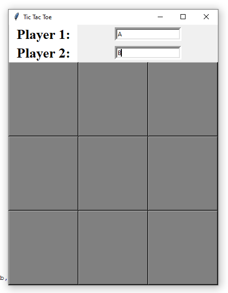
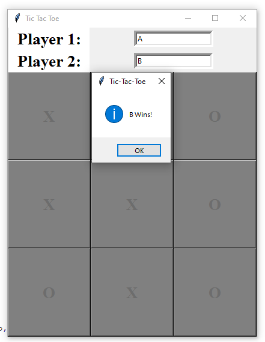

# Tic-Tac-Toe-Game-in-Python
Tic-tac-toe is a very popular game, so this game is implemented using Python.
So, the best and the most fun way to learn any programming language for me has always been by developing a fun project like a simple game or some project that I would use in my daily life.

We are going to build a two-player tic-tac-toe game, which we can play in the GUI made by using Tkinter. Initially, we’ll make an empty game board and then we’ll take inputs from the players and we’ll check for the winning condition and if the whole board gets filled and no one wins, we’ll declare the result as “Tie”.

## Installation
- `Only Python3 should be installed`

## To Run the Game
- `python tictactoe.py`

## Screenshots

Just follow☝️ me and Star⭐ my repository

